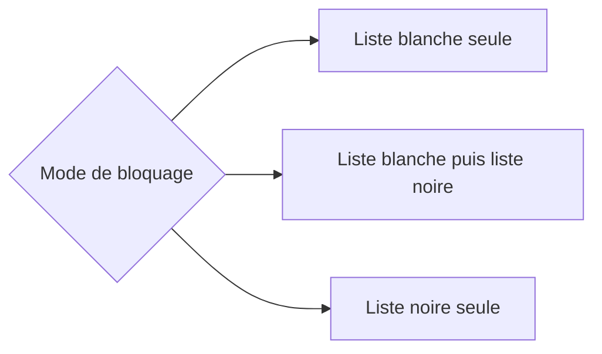
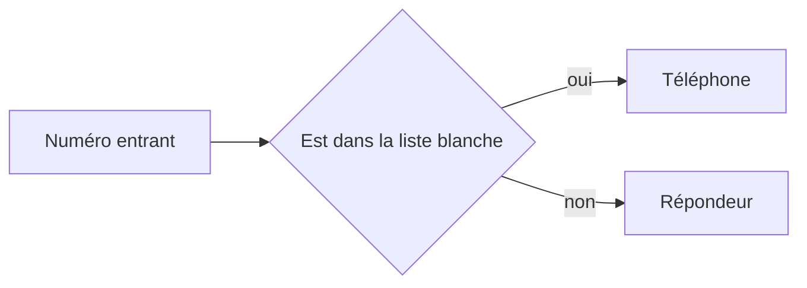
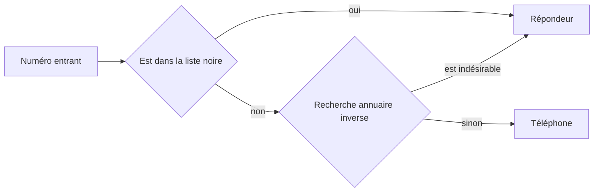
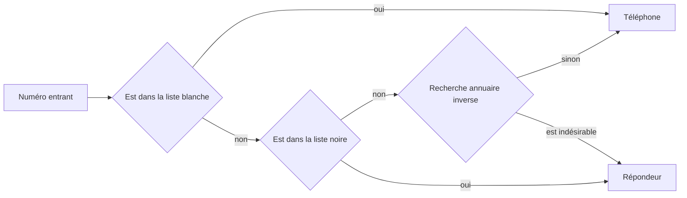

# Gestion des appels entrants
Il existe 3 configurations de bloquage possible pour chaque ligne dans l'application.

## Filtrage liste blanche

## Filtrage liste noire

## Fitrage liste blanche puis liste noire

